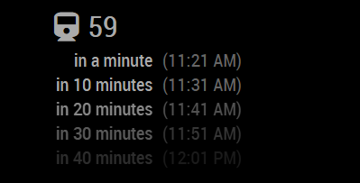
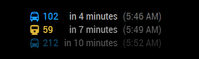
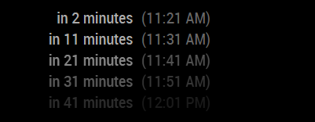
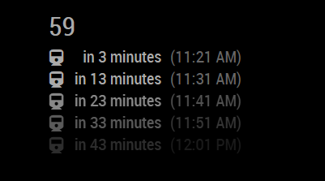
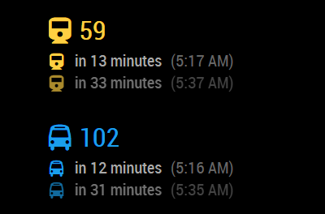
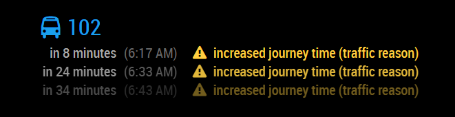
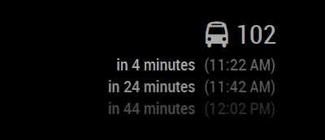

# MMM-Futar

This is a module for the [MagicMirror²](https://github.com/MichMich/MagicMirror/) to display Budapest public transport information using real-time data from the "Futár" service provided by the Centre for Budapest Transport (BKK).

## Features

By default this module displays the departure times of the configured route in the configured stop:



Or, if you wish, you can display all departures from the configured stop:



If you wish, you can hide the complete head:



You can also configure whether you want the module to hide the symbol in the head, and/or show the symbol at every stop time:



You can even decide to display the symbols and route text with the color matching the route type (enabled by default from version 1.2.0, but can be optionally disabled):



The module by default displays operation alerts for the selected routes (available from version 1.3.0):



If you decide to put the module on the right column, you can set the module to right align its content:



This module is capable to display only a single stop and route data. If you would like to see the departure times of more stops and routes on your mirror, add this module multiple times.

For updates, please check the [CHANGELOG](https://github.com/balassy/MMM-Futar/blob/master/CHANGELOG.md).

## Using the module

To use this module follow these steps:

1. Clone this repository to the `modules` folder of your MagicMirror:

```bash
git clone https://github.com/balassy/MMM-Futar.git
```

2. Add the following configuration block to the modules array in the `config/config.js` file:

```js
var config = {
  modules: [
    {
      module: 'MMM-Futar',
      position: 'top_left',
      config: {
        stopId: 'BKK_F02285',
        routeId: 'BKK_1020',
        minutesAfter: 50,
        hideStopTimesInNextMinutes: 0,
        updateInterval: 60000, // 1 minute in milliseconds
        showHead: true, // true | false
        showSymbolInHead: true, // true | false
        showSymbolInStopTime: false, // true | false
        showRouteNameInStopTime: false, // true | false
        maxNumberOfItems: 3,
        align: 'left', // 'left' | 'right'
        fade: true,
        fadePoint: 0.25,
        coloredSymbolInHead: true, // true | false
        coloredTextInHead: true, // true | false
        coloredSymbolInStopTime: true, // true | false
        coloredRouteNameInStopTime: true, // true | false
        symbolColors: {
          tram: '#ffcf42', // yellow-ish
          bus: '#1a9fed', // blue-ish
          subway: '#b3090c', // red-ish
          trolleybus: '#931517', // dark red-ish
          rail: '#5cbc82', // green-ish
          ferry: '#1a52ed' // dark-blue-ish
        },
        alerts: {
          showHeaderInStopTime: true, // true | false
          showSymbolInStopTime: true, // true | false
          color: '#ffcf42', // 'auto' or any CSS color
          language: 'en' // 'en' or 'hu' supported only by the Futár API
        }
      }
    }
  ]
}
```

## Configuration options

| Option                 | Description
|------------------------|-----------
| `stopId`               | **REQUIRED** The unique identifier of the stop. See below for more details about how to acquire it.<br><br> **Type:** `string` <br>**Default value:** `(empty)`
| `routeId`              | *Optional* The unique identifier of the route, which can be used to filter the departure times, if multiple routes share the same stop. <br><br> **Type:** `string` <br>**Default value:** `(empty)`
| `minutesAfter`         | *Optional* The number of minutes of how far the module should list the departure times in the future. Increase this value to show more departure times, or decrease it to display less, and make the module smaller. <br><br>**Type:** `int` (minutes) <br>**Default value:** `50`
| `hideStopTimesInNextMinutes` | *Optional* The number of next minutes for which the module should not display departure times. For example if the nearest stop is in a 5-minute walk from your home, you can set this value to `5` to not show departures in the next 5 minutes. <br><br>**Type:** `int` (minutes) <br>**Default value:** `0`
| `updateInterval`       | *Optional* The frequency of when the module should query the departure times from the Futár service. <br><br>**Type:** `int` (milliseconds) <br>**Default value:** `60000` milliseconds (1 minute)
| `showHead`             | *Optional* Determines whether the module should display a custom headline (independently from the standard headline of the module). The route name in the head is based on the data received from the Futár service. <br><br>**Type:** `boolean` <br>**Default value:** `true`
| `showSymbolInHead`     | *Optional* Determines whether the custom headline should show the icon of the route.<br><br>**Type:** `boolean`  <br>**Default value:** `true`
| `showSymbolInStopTime` | *Optional* Determines whether every stop time line should show the icon of the route. <br><br>**Type:** `boolean`  <br>**Default value:** `false`
| `showRouteNameInStopTime` | *Optional* Determines whether every stop time line should show the name of the route. <br><br>**Type:** `boolean`  <br>**Default value:** `false`
| `maxNumberOfItems`     | *Optional* Determines the limit for the number of displayed departure times. <br><br>**Type:** `number`  <br>**Default value:** `3`
| `align`                | *Optional* Determines how the text is aligned within the module.<br><br>**Type:** `string`<br>**Possible values**: `left` or `right`<br>**Default value:** `left`
| `fade`                 | *Optional* Determines whether the future stop times are gradiently faded to black.<br><br>**Type:** `boolean`  <br>**Default value:** `true`
| `fadePoint`            | *Optional* Determines where the fading should be started.<br><br>**Type:** `double`<br>**Possible values:** `0` (top of the list) - `1` (bottom of the list)<br>**Default value:** `0.25`
| `coloredSymbolInHead`     | *Optional* Determines whether the symbol in the head should be displayed with the color of the route type (e.g. blue for bus). <br><br>**Type:** `boolean`  <br>**Default value:** `true`
| `coloredTextInHead`       | *Optional* Determines whether the route name text in the head should be displayed with the color of the route type (e.g. yellow for tram). <br><br>**Type:** `boolean`  <br>**Default value:** `true`
| `coloredSymbolInStopTime` | *Optional* Determines whether the symbol in every stop time line should be displayed with the color of the route type (e.g. blue for bus). <br><br>**Type:** `boolean`  <br>**Default value:** `true`
| `coloredRouteNameInStopTime` | *Optional* Determines whether the route name in every stop time line should be displayed with the color of the route type (e.g. blue for bus). <br><br>**Type:** `boolean`  <br>**Default value:** `true`
| `symbolColors`            | *Optional* Allows overriding the colors of the route types. Used only if any `colored...` options is set to `true`. <br><br>**Type:** `object`  <br>**Default value:** (see above)
| `alerts`                  | *Optional* Allows configuring how route alerts are displayed. See the "Alert options" section below for more details. <br><br>**Type:** `object`  <br>**Default value:** (see above)

### Alert options

The following properties are available for the `alerts` object of the configuration object:

| Option                 | Description
|------------------------|-----------
| `showHeaderInStopTime` | *Optional* Determines whether the alert header (short alert message) should be displayed in the line of every stop time.<br><br>**Type:** `boolean`  <br>**Default value:** `true`
| `showSymbolInStopTime` | *Optional* Determines whether the alert icon (exclamation mark) should be displayed in the line of every stop time.<br><br>**Type:** `boolean`  <br>**Default value:** `true`
| `color`                | *Optional* Determines the color of the alert messages.<br><br>**Type:** `string`  <br>**Possible values:** `'auto'` to use the text color of the mirror or any valid CSS color <br>**Default value:** `#ffcf42` (yellow)
| `language`             | *Optional* Determines the language of the alert messages.<br><br>**Type:** `string`  <br>**Possible values:** `'en'` or `'hu'` (only these two are supported by the Futár service)<br> **Default value:** the language of the mirror (set in the `language` property in `config.js`)


## How to get the `stopId` and `routeId`

To get the stop and route identifiers required by this module, follow these steps:

### `stopId`

1. Launch Google Chrome and navigate to https://futar.bkk.hu.

2. Zoom until your favorite stop is shown on the map.

3. Hover your mouse over your favorite stop and wait until a pop-up window appears.

4. Note that the pop-up window contains the ID of the stop in the format of `#F02285`.

5. Configure the `stopId` configuration value by removing the `#` sign and prepending `BKK_`, for example `BKK_F02285`.

### `routeId`

1. Launch Google Chrome and navigate to https://futar.bkk.hu.

2. Zoom until your favorite stop is shown on the map.

3. Click on your favorite stop icon until a pop-up window appears. On that window, click on the line which you reveal it's `routeId` (under the stopId, not on the arrivals list, this is important!!!)

5. On the left panel select the direction which needed.

6. Hover your mouse over your stop.

7. Right click, copy the link address and it should reveal the `stopId` and the `routeId` as well.

## How it works

This module periodically sends requests from the browser window of the MagicMirror Electron application to the [BKK Futár Webservice](https://futar.bkk.hu/). Although the service is free and public, its API is not publicly documented, so the module was created by understanding the current communication.

The API does not require any API key.

You can see an example by visiting this URL: http://futar.bkk.hu/bkk-utvonaltervezo-api/ws/otp/api/where/arrivals-and-departures-for-stop.json?stopId=BKK_F02285&onlyDepartures=true&minutesBefore=0&minutesAfter=50

## Localization

Currently this module supports English (`en`) and Hungarian (`hu`) languages. The language can be specified in the global `language` setting in the `config.js` file.

Want to see more languages? Please contribute!

## Contribution

Although for operation this module does not depend on any other module, if you would like to contribute to the codebase, please use the preconfigured linters to analyze the source code before sending a pull request. To run the linters follow these steps:

1. Install developer dependencies:

```bash
npm install
```

2. Install Grunt:

```bash
npm install -g grunt
```

3. Use Grunt to run all linters:

```bash
grunt
```

## Got feedback?

Your feedback is more than welcome, please send your suggestions, feature requests or bug reports as [Github issues](https://github.com/balassy/MMM-Futar/issues).

## About the author

This project is created and maintaned by [György Balássy](https://www.linkedin.com/in/balassy).
